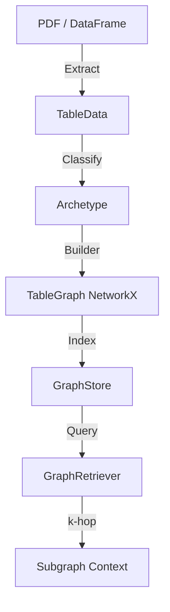
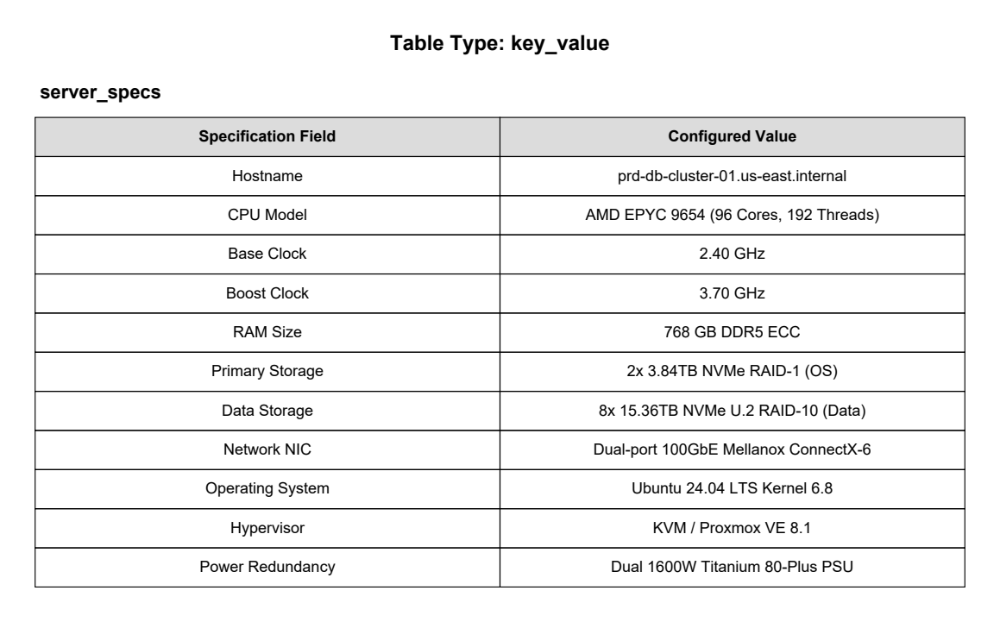
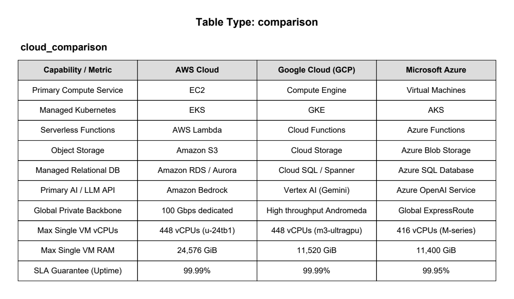
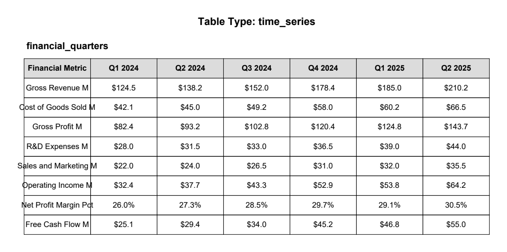
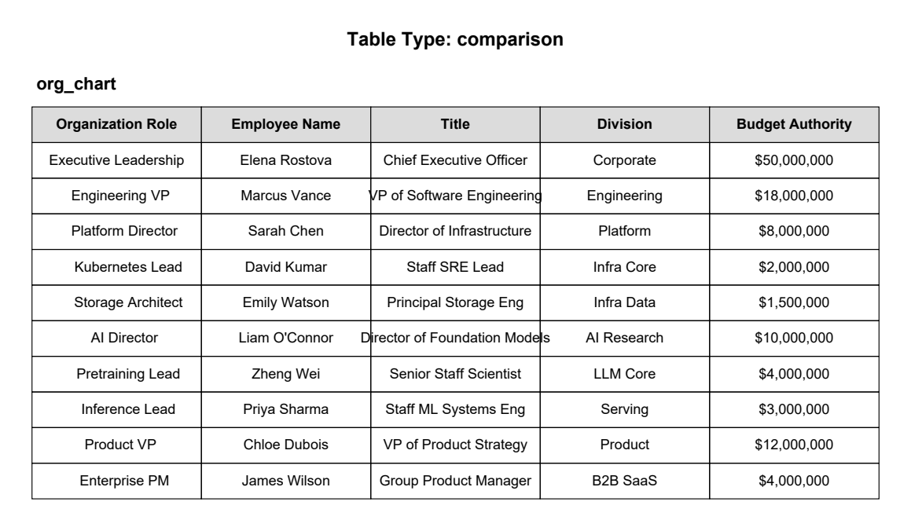
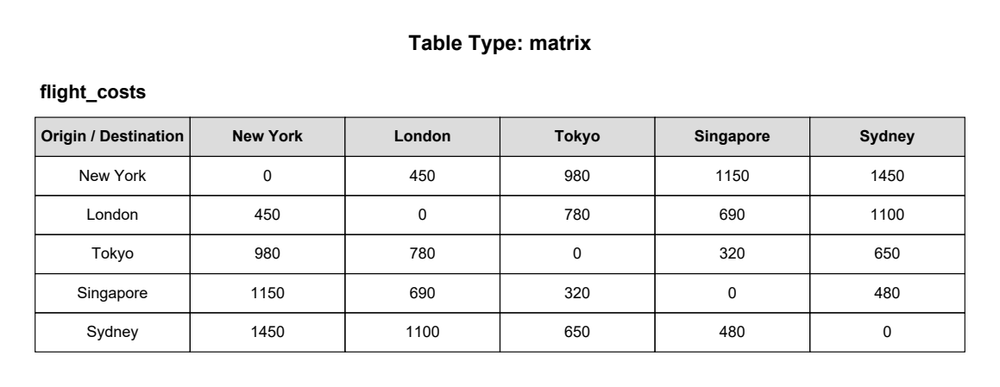
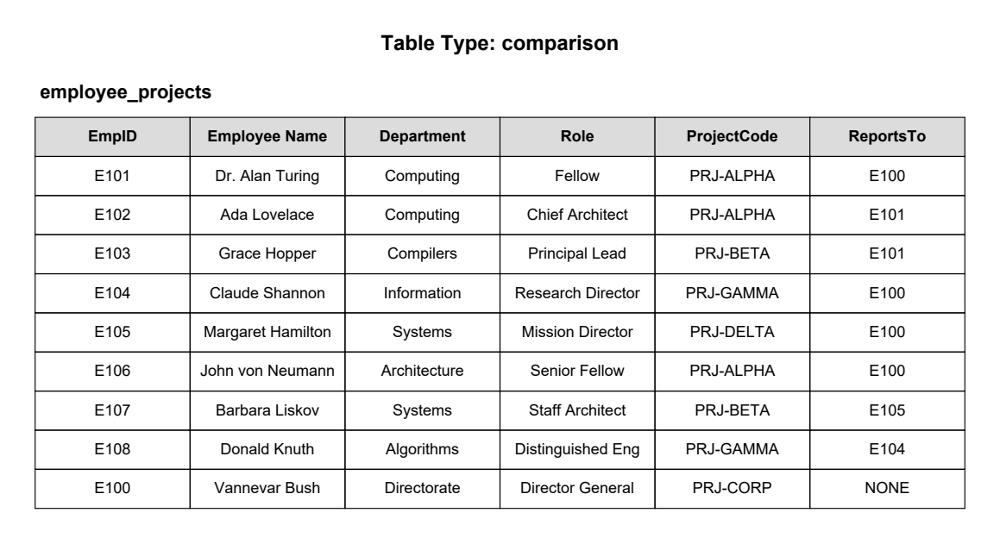
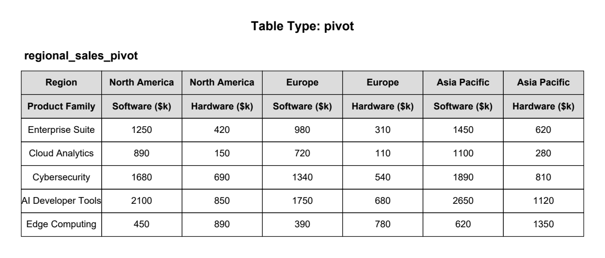

# table-to-graph

> **Convert PDF tables to typed, queryable graphs for high-accuracy RAG pipelines.**

[]()
[]()

`table-to-graph` is a Python library that bridges the gap between unstructured documents and graph-based reasoning. Flat-text chunking destroys the 2D relational structure of tables. This library extracts tables, classifies their structural archetype (e.g., Pivot, Time-Series, Relational), and converts them into typed NetworkX graphs for precise sub-graph retrieval.

## 🚀 Why table-to-graph?

When you embed a table as flat text (CSV or Markdown strings), the LLM loses track of column headers, row relationships, and nested groupings. 

`table-to-graph` solves this by:
1. **Extracting** tables from PDFs (via `pdfplumber`), DataFrames, or raw text.
2. **Classifying** them into 7 structural archetypes.
3. **Building** accurate graph representations (e.g., bipartite, hierarchical).
4. **Retrieving** relevant subgraphs using k-hop expansion.
5. **Serializing** the context into LLM-optimized structured text.

### Architecture



### Extraction: pdfplumber vs TATR
This library uses a hybrid extraction engine to balance speed, accuracy, and footprint:
- **`pdfplumber` (Primary):** Used by default for fast, deterministic extraction of standard grid-based tables utilizing underlying PDF drawing commands and raw text coordinates.
- **`TATR` (Fallback):** The Table Transformer (a Hugging Face vision model) is invoked automatically as a fallback when `pdfplumber` detects a complex layout (like a staggered matrix) that it cannot parse cleanly. When TATR is used, it detects the table structure visually, and then strictly aligns those visual boxes with `pdfplumber`'s underlying text coordinates to extract the data accurately without OCR hallucination.

## 📦 Installation

**Prerequisites:** Python 3.10 through 3.13 is supported.

### Tested with

- **Python:** 3.13.13
- **Operating system:** Windows

The code is cross-platform and is expected to run on Ubuntu and other supported operating systems.

### Without Source Code (End Users)
If you just want to use the library in your own project, you can install it directly via pip:
```bash
pip install table-to-graph
```

### With Source Code (Developers)
If you want to contribute, run benchmarks, or modify the source code, clone the repository and install the dependencies locally. 

The project natively uses [Poetry](https://python-poetry.org/) for dependency management:
```bash
poetry install
```

If you prefer not to use Poetry, a standard `requirements.txt` is provided in the root folder. You can install the local development dependencies using:
```bash
pip install -r requirements.txt
```

*Note for contributors: `requirements.txt` is provided for broad compatibility. If you add new dependencies to `pyproject.toml`, please keep it in sync by running:*
```bash
poetry export -f requirements.txt --output requirements.txt
```

## ⚡ Quick Start

The simplest way to use the library is via the high-level facade:

```python
from table_to_graph import table_to_graph

# 1. Convert a PDF directly to Cypher statements for Neo4j
cypher_script = table_to_graph("financial_report.pdf", format="cypher")
print(cypher_script)

# 2. Convert to LLM-optimized Markdown
md_context = table_to_graph("data.csv", format="markdown")
```

### Advanced: RAG Retrieval Pipeline

If you want to query the graph directly instead of exporting it:

```python
from table_to_graph import extract_tables, build_graph, retrieve_context

# 1. Extract and classify tables
tables = extract_tables("employee_data.pdf", classify=True)

# 2. Build graph representations
graphs = [build_graph(t) for t in tables]

# 3. Retrieve relevant subgraph context for an LLM prompt
query = "Who is Alice's manager?"
context = retrieve_context(
    graphs=graphs,
    query=query,
    strategy="node-centric", # or "edge-centric", "path-centric"
    top_k=5,                 # find top 5 seed nodes
    k_hops=1                 # expand 1 hop around seeds
)

print(context)
# Inject `context` into your LLM prompt!
```

## 📊 Benchmarks & Testing

In complex relational tables (e.g., Pivot tables, FK references), flat-text chunking often fails to retrieve the intersecting header. `table-to-graph` preserves this via property edges and graph expansion.

**120-Query Comprehensive Benchmark Results (7 Table Archetypes):**

| Method | Target-token context hit rate | Average latency |
|--------|-------------------------------|-----------------|
| Flat-Text Chunking | 59.2% | N/A |
| **Table-to-Graph** | **100.0%** | **~3.2 ms** |

The benchmark is a deterministic retrieval regression over generated tables. A query counts as
a hit when every expected target token is present in the retrieved context. It does not measure
LLM answer generation, false-positive precision, or performance on an independent real-world corpus.

### Running the Benchmark
You can reproduce the target-token context hit rate locally by running the benchmark suite:
```bash
poetry run python -m benchmarks.benchmark_retrieval
```

### Running Tests
To run the automated test suite and ensure all extraction, classification, and graph building pipelines are functioning:
```bash
poetry run pytest
```

### Code Quality & Security Checks
This project strictly enforces code quality, static typing, and security vulnerability scanning. 

We have provided a unified wrapper command to run everything (formatting, linting, type-checking, security scanning, and unit tests) sequentially:

```bash
poetry run check_code_quality
```
## 🧩 Supported Archetypes

The classifier automatically detects and routes tables to the correct graph builder:

1. **Key-Value**: Star graph (Entity → Properties)
   <br>
   
   <br>
   *Reference: [`benchmarks/benchmark_tables_1.pdf`](benchmarks/benchmark_tables_1.pdf) (Page 1)*

2. **Comparison**: Bipartite graph (Entities ↔ Attributes)
   <br>
   
   <br>
   *Reference: [`benchmarks/benchmark_tables_1.pdf`](benchmarks/benchmark_tables_1.pdf) (Page 3)*

3. **Time-Series**: Temporal chain with `NEXT` edges
   <br>
   
   <br>
   *Reference: [`benchmarks/benchmark_tables_1.pdf`](benchmarks/benchmark_tables_1.pdf) (Page 5)*

4. **Hierarchical**: Stack-based tree/DAG
   <br>
   
   <br>
   *Reference: [`benchmarks/benchmark_tables_2.pdf`](benchmarks/benchmark_tables_2.pdf) (Page 1)*

5. **Matrix**: Weighted undirected graph
   <br>
   
   <br>
   *Reference: [`benchmarks/benchmark_tables_2.pdf`](benchmarks/benchmark_tables_2.pdf) (Page 3)*

6. **Relational**: Entity-relationship with resolved foreign keys
   <br>
   
   <br>
   *Reference: [`benchmarks/benchmark_tables_3.pdf`](benchmarks/benchmark_tables_3.pdf) (Page 1)*

7. **Pivot**: Multi-dimensional hypergraph
   <br>
   
   <br>
   *Reference: [`benchmarks/benchmark_tables_3.pdf`](benchmarks/benchmark_tables_3.pdf) (Page 2)*

## 🛠️ Integrations

The output of `ContextSerializer` is pure text and works natively with:
- **LangChain**: Wrap `retrieve_context` in a `BaseRetriever`.
- **LlamaIndex**: Use graphs as a custom `NodeParser` output.
- **Neo4j**: Use `format="cypher"` to hydrate an external graph DB.

## ⚠️ Limitations & Known Issues

While `table-to-graph` achieves a 100% target-token context hit rate on its generated regression
suite, it is not a silver bullet. Current limitations include:
1. **Unstructured Visuals:** TATR (Table Transformer, the underlying vision model) excels at grid-like and staggered tables, but will struggle with hand-drawn tables, complex infographics, or tables embedded within charts.
2. **Dense Multipage Tables:** Tables that span across multiple pages without repeated headers can occasionally cause extraction fragmentation.
3. **Heavy Vision Dependencies:** Activating the TATR model requires `torch`, `torchvision`, and `transformers`, which significantly increases the Docker image size and deployment footprint.

## 🐛 Debugging

If you are encountering retrieval issues or pipeline crashes, use the built-in diagnostic tools:

1. **Verbose Logging:** Run the benchmark with `--debug` (for example,
   `poetry run python -m benchmarks.benchmark_retrieval --debug`) to print the bounding boxes and
   word alignments detected by `pdfplumber` and TATR.
2. **Graph Serialization Validation:** Inspect the output of `ContextSerializer` directly. If your subgraphs are missing metadata, verify that the `TableMetadata` object is correctly propagating the `context` attribute during extraction.

## 🚀 Future Improvements

- **VLM Fallback:** Integrate a Vision-Language Model (e.g., SmolVLM, Phi-4-Vision) as a tertiary fallback for edge-case infographics where TATR fails.
- **Multipage Table Stitching:** Improve heuristic tracking of table continuations across page breaks.
- **Graph Pruning:** Implement LLM-based graph pruning during the `retrieve_context` step to remove irrelevant nodes *before* context injection.

## ⚖️ License Notes

The project is licensed under Apache-2.0. The table below records the declared licenses of direct
dependencies at the time of review; it is not legal advice or a guarantee for every transitive
dependency, optional model weight, or future version. Review the complete dependency and model
license set for your deployment.

| Dependency | Declared license |
|------------|------------------|
| `table-to-graph` | Apache-2.0 |
| `pdfplumber` | MIT |
| `networkx` | BSD-3-Clause |
| `transformers` / `torch` | Apache-2.0 / BSD-3-Clause |
| `pypdfium2` (PDF rendering) | Apache-2.0 / BSD-3-Clause |

*Note: Previous versions used `PyMuPDF` for PDF rendering. The current implementation uses
`pypdfium2`; review historical distributions, transitive dependencies, and optional model licenses
independently for your use case.*

## 📄 License

Apache License 2.0. See `LICENSE` for details.
